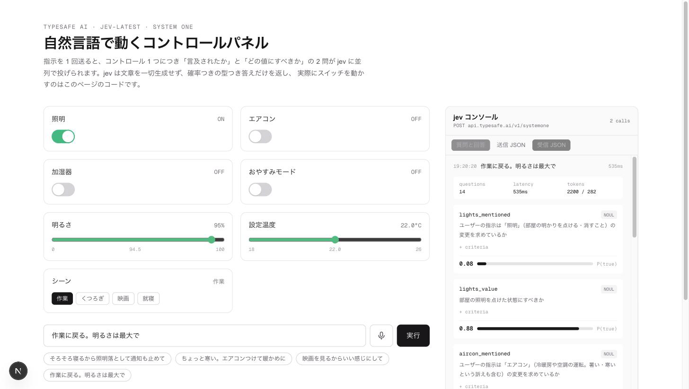

# jev-demo

[TypeSafe AI](https://typesafe.ai/) の **jev**（System One モデル）で、自然言語の指示から Web アプリの UI を操作するデモです。

「そろそろ寝るから照明落として通知も止めて」と入力（または音声で発話）すると、画面上のトグル・スライダー・選択ボタンが実際に動きます。



## jev が何をして、何をしていないか

jev はテキストを一切生成しません。`state`（現在の状態）と型つきの `questions` を送ると、各質問に**確率つきの型安全な答え**だけを返します。

| プリミティブ | 返るもの |
| --- | --- |
| **Noul** | `P(true)` を 0〜1 で |
| **Choice** | 定義した選択肢のうち 1 つ + 各選択肢の確率 + confidence |
| **Score** | 順序つきレベル上の小数位置 + legend + 確率分布 + confidence |

スキーマにない値は構造上返ってこないため、「存在しないボタンを押そうとする」ことが起きません。

つまり jev は **どのコントロールを・どの値にするかを決める**だけで、実際に state を書き換えるのはこのアプリのコードです。

```
自然言語 ──▶ jev（判定）──▶ アプリのコードが setState ──▶ UI が変わる
```

## 仕組み

コントロール 1 つにつき質問を 2 問つくり、**全部まとめて 1 リクエストで並列評価**させます（7 コントロール = 14 問、実測 600〜900ms）。

```
<id>_mentioned … そもそもこのコントロールに言及しているか（Noul）
<id>_value     … どの値にすべきか（Noul / Score / Choice）
```

言及されていないコントロールは、値の答えが返っていても無視します。これで**指示に無い設定が勝手に動きません**。

判定は `lib/plan.ts` の 3 つのしきい値で決まります。

| 条件 | 結果 |
| --- | --- |
| `mentioned < 0.5` | 触らない（現状維持） |
| `mentioned >= 0.7` かつ 値の `confidence >= 0.5` | 自動適用 |
| どちらかが低い | 適用せず「○○を X → Y に変更しますか？」の確認を出す |
| 変更後の値が現在値と同じ | 変更なし |

曖昧な指示ほど確率が割れるので、`確信度が低いので確認します` のバーが出ます。確率分布そのものは右の [jev コンソール](#jev-コンソール) で確認できます。

### 言及判定のコツ

各コントロールには `mentionHint`（どんな表現なら言及とみなすか）を持たせています。ラベル名だけを渡すと、たとえば「通知も止めて」という明示的な指示があっても「おやすみモード」という単語を使っていないために言及なし（0.31）と判定されてしまいました。hint を criteria に含めることで 0.97 まで改善しています。**`instructions` と `criteria` の書き方が精度にそのまま効きます。**

## コントロール

| 種別 | コントロール |
| --- | --- |
| Noul | 照明 / エアコン / 加湿器 / おやすみモード |
| Score | 明るさ（5 段階 → 0-100%）/ 設定温度（5 段階 → 18-26°C） |
| Choice | シーン（作業・くつろぎ・映画・就寝） |

定義はすべて `lib/controls.ts` にあり、UI の描画と jev への質問生成が同じ定義を参照します。コントロールを足すときはここに 1 つ追加するだけです。

## jev コンソール

画面右側に、jev とのやり取りをそのまま覗けるコンソールがあります。何が送られ、何が返ってきたのかを追うためのものです。

| タブ | 内容 |
| --- | --- |
| **質問と回答** | 質問 1 つと、その答えを 1 対 1 で並べる。`instructions` と（開くと）`criteria`、返ってきた確率分布を確率バーで表示 |
| **送信 JSON** | エンドポイント・モデル・`state`・`questions` を、実際に送ったそのままの形で |
| **受信 JSON** | jev のレスポンス全体。実際に応答したモデルのバージョン（例 `jev-1.13.0`）もここで分かる |

各呼び出しには `questions` の数・レイテンシ・入出力トークン数が付きます。過去のやり取りは履歴として残り、クリックで開き直せます（新しい呼び出しが来ると自動でそちらが開きます）。

コンソールに出す内容は Route Handler が返します。jev に送ったペイロードをサーバ側で組み立てているため、クライアント側で作り直すのではなく**実際に送った値そのもの**をレスポンスに含めています（`app/api/command/route.ts` の `CommandResult`）。

## 音声入力

Web Speech API を使い、発話が確定した時点でそのまま jev に送ります。Chrome / Safari で動作し、非対応ブラウザではマイクボタンを表示しません。

## セットアップ

```bash
npm install
cp .env.example .env.local   # TYPESAFE_API_KEY を記入
npm run dev
```

API キーは [TypeSafe のコンソール](https://console.typesafe.ai/)の **API Keys** から発行します。キーはサーバ側の Route Handler (`app/api/command/route.ts`) でのみ読み、クライアントには渡していません。

```bash
npm run typecheck   # tsc --noEmit
npm run lint        # eslint
npm run build       # 本番ビルド
```

## 構成

```
lib/jev.ts                   POST /v1/systemone の型つきクライアント
lib/controls.ts              コントロール定義（UI と質問生成の唯一の情報源）
lib/plan.ts                  質問の組み立てと、回答 → 操作プランへの変換
lib/use-speech-recognition.ts  Web Speech API の最小ラッパー
app/api/command/route.ts     API キーをサーバ側に閉じ込めるハンドラ。送信内容もそのまま返す
app/control-panel.tsx        パネル UI
app/jev-console.tsx          jev との入出力を表示するコンソール
```

Next.js 16 (App Router, Turbopack) / React 19 / Tailwind CSS v4。

## 参考

- [jev の紹介](https://docs.typesafe.ai/introduction)
- [API リファレンス](https://docs.typesafe.ai/api)
- [Function calling クックブック](https://docs.typesafe.ai/cookbooks/function_calling)（このデモと同じ closed-set パターン）

## ライセンス

[MIT](LICENSE)
