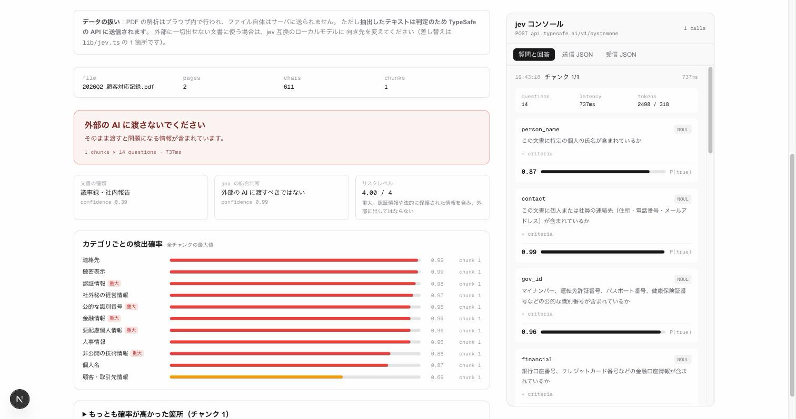
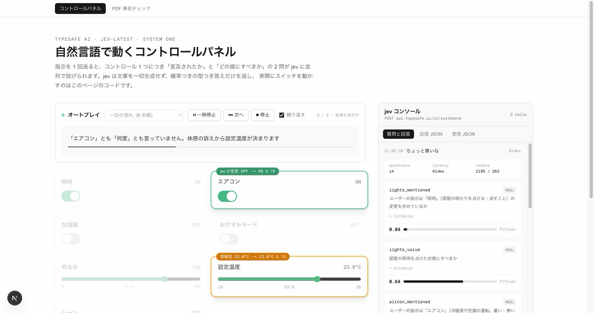
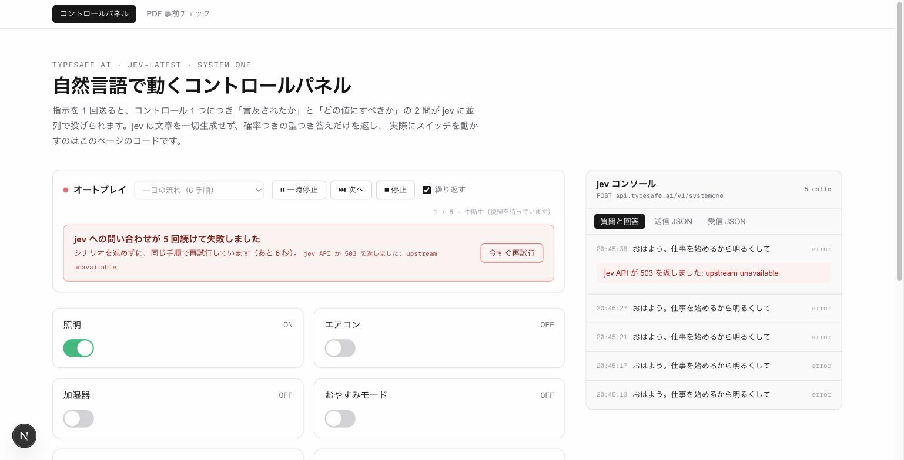

# jev-demo

[TypeSafe AI](https://typesafe.ai/) の **jev**（System One モデル）を組み込んだ Next.js のデモです。

2 つのデモが入っています。

| | 内容 |
| --- | --- |
| [コントロールパネル](#コントロールパネル) (`/`) | 「そろそろ寝るから照明落として通知も止めて」と入力または発話すると、画面上のトグル・スライダー・選択ボタンが実際に動く。[オートプレイ](#オートプレイ)つき |
| [PDF 事前チェック](#pdf-事前チェック) (`/screening`) | 社外の AI に PDF を渡す前に、個人情報や機密情報が含まれていないかを判定する |


## jev が何をして、何をしていないか

jev はテキストを一切生成しません。`state`（現在の状態）と型つきの `questions` を送ると、各質問に**確率つきの型安全な答え**だけを返します。

| プリミティブ | 返るもの |
| --- | --- |
| **Noul** | `P(true)` を 0〜1 で |
| **Choice** | 定義した選択肢のうち 1 つ + 各選択肢の確率 + confidence |
| **Score** | 順序つきレベル上の小数位置 + legend + 確率分布 + confidence |

スキーマにない値は構造上返ってこないため、「存在しないボタンを押そうとする」ことが起きません。

つまり jev は **どのコントロールを・どの値にするかを決める**だけで、実際に state を書き換えるのはこのアプリのコードです。

```
自然言語 ──▶ jev（判定）──▶ アプリのコードが setState ──▶ UI が変わる
```

## コントロールパネル

### 仕組み

コントロール 1 つにつき質問を 2 問つくり、**全部まとめて 1 リクエストで並列評価**させます（7 コントロール = 14 問、実測 600〜900ms）。

```
<id>_mentioned … そもそもこのコントロールに言及しているか（Noul）
<id>_value     … どの値にすべきか（Noul / Score / Choice）
```

言及されていないコントロールは、値の答えが返っていても無視します。これで**指示に無い設定が勝手に動きません**。

判定は `lib/plan.ts` の 3 つのしきい値で決まります。

| 条件 | 結果 |
| --- | --- |
| `mentioned < 0.5` | 触らない（現状維持） |
| `mentioned >= 0.7` かつ 値の `confidence >= 0.5` | 自動適用 |
| どちらかが低い | 適用せず「○○を X → Y に変更しますか？」の確認を出す |
| 変更後の値が現在値と同じ | 変更なし |

曖昧な指示ほど確率が割れるので、`確信度が低いので確認します` のバーが出ます。確率分布そのものは右の [jev コンソール](#jev-コンソール) で確認できます。

#### 言及判定のコツ

各コントロールには `mentionHint`（どんな表現なら言及とみなすか）を持たせています。ラベル名だけを渡すと、たとえば「通知も止めて」という明示的な指示があっても「おやすみモード」という単語を使っていないために言及なし（0.31）と判定されてしまいました。hint を criteria に含めることで 0.97 まで改善しています。**`instructions` と `criteria` の書き方が精度にそのまま効きます。**

### コントロール

| 種別 | コントロール |
| --- | --- |
| Noul | 照明 / エアコン / 加湿器 / おやすみモード |
| Score | 明るさ（5 段階 → 0-100%）/ 設定温度（5 段階 → 18-26°C） |
| Choice | シーン（作業・くつろぎ・映画・就寝） |

定義はすべて `lib/controls.ts` にあり、UI の描画と jev への質問生成が同じ定義を参照します。コントロールを足すときはここに 1 つ追加するだけです。

## jev コンソール

画面右側に、jev とのやり取りをそのまま覗けるコンソールがあります。何が送られ、何が返ってきたのかを追うためのものです。

| タブ | 内容 |
| --- | --- |
| **質問と回答** | 質問 1 つと、その答えを 1 対 1 で並べる。`instructions` と（開くと）`criteria`、返ってきた確率分布を確率バーで表示 |
| **送信 JSON** | エンドポイント・モデル・`state`・`questions` を、実際に送ったそのままの形で |
| **受信 JSON** | jev のレスポンス全体。実際に応答したモデルのバージョン（例 `jev-1.13.0`）もここで分かる |

各呼び出しには `questions` の数・レイテンシ・入出力トークン数が付きます。過去のやり取りは履歴として残り、クリックで開き直せます（新しい呼び出しが来ると自動でそちらが開きます）。

コンソールに出す内容は Route Handler が返します。jev に送ったペイロードをサーバ側で組み立てているため、クライアント側で作り直すのではなく**実際に送った値そのもの**をレスポンスに含めています（`app/api/command/route.ts` の `CommandResult`）。

## 音声入力

Web Speech API を使い、発話が確定した時点でそのまま jev に送ります。Chrome / Safari で動作し、非対応ブラウザではマイクボタンを表示しません。

## PDF 事前チェック



ローカル LLM のチャットアプリなどに PDF を添付する前段のゲートです。D&D した時点で判定が走り、**アップロードする前に**渡してよい文書かどうかが分かります。

この用途に jev が向いているのは、**文章を生成しないから**です。返ってくるのはカテゴリごとの確率だけで、判定結果に本文が要約されて出てくることがありません。「中身を見ずに、中身の性質だけを数値で受け取る」形になります。

### 質問の構成

チャンクごとに 14 問を 1 リクエストで投げます（`lib/screening.ts`）。

| 種別 | 質問 |
| --- | --- |
| Noul × 11 | 個人名 / 連絡先 / 公的な識別番号 / 金融情報 / 認証情報 / 要配慮個人情報 / 人事情報 / 顧客・取引先情報 / 社外秘の経営情報 / 機密表示 / 非公開の技術情報 |
| Score | 社外の AI に渡した場合のリスク（5 段階） |
| Choice | 文書の種類 |
| Choice | jev 自身の総合判断（allow / redact / block） |

### 集約と判定

長い PDF は 1200 字前後のチャンクに割り（最大 16）、同じ質問セットを並列で投げます。カテゴリごとに**全チャンクの最大値**を採ります。1 箇所でも該当すれば文書全体が該当だからです。

| 条件 | 結論 |
| --- | --- |
| 重大カテゴリ（識別番号・金融・認証・要配慮・技術情報）のいずれかが 0.8 以上 | **渡さない** |
| いずれかのカテゴリが 0.5 以上 | **要確認** |
| それ以外 | 渡してよい |

最終的な結論はこのしきい値で決めています。jev 自身の総合判断も並べて表示するので、両者を見比べられます。

### データの扱い

PDF の解析は **ブラウザ内**（[unpdf](https://github.com/unjs/unpdf)）で行われ、ファイル自体はサーバに送られません。ただし**抽出したテキストは判定のため TypeSafe の API に送信されます**。外部に一切出せない文書に使う場合は、jev 互換のローカルモデルに向き先を変えてください。差し替えは `lib/jev.ts` の `ENDPOINT` / `MODEL` の 1 箇所です。

## オートプレイ



展示会で流しっぱなしにするためのモードです。用意したシナリオを順に jev へ送り、一連の操作を無人で再生します。

- 指示は**人が打っているように 1 文字ずつ**入力欄に現れてから送信されます
- 手順ごとに観客向けの一言を表示します（何を見ればよいかを先に伝える）
- **jev が動かしたコントロールだけを浮かび上がらせ、それ以外を沈めます**（下記）
- 確認バーが出る手順では、数秒見せてから自動で承認します。曖昧な指示を jev が検出する様子そのものが見せ場なので、飛ばしません
- 一時停止・次へ・停止・繰り返しに対応。停止すると手入力に戻ります
- 繰り返しの先頭でパネルを初期状態に戻すので、何周しても同じ流れになります
- **失敗が続いたら中断して復帰を待ちます**（下記）

シナリオは `lib/scenarios.ts` にあります。`command`（送る指示）と `note`（観客向けの説明）、`hold`（結果を見せておく時間）の組です。

```ts
{
  command: "ちょっと寒いな",
  note: "「エアコン」とも「何度」とも言っていません。体感の訴えから設定温度が決まります",
  hold: 5500,
}
```

### 注目ポイントの表示

展示会では、来場者が画面のどこを見ればよいのか分かりません。jev の応答が返った時点で、**動いたコントロールにリングと吹き出しを重ね、動かなかったものを薄くします**。

吹き出しには `OFF → ON` のような変化と確信度が出ます。確認を挟むものは橙色で `要確認` と表示され、自動承認されるまでそのまま残ります。上のスクリーンショットでは「ちょっと寒いな」に対して、エアコン（緑・確定）と設定温度（橙・要確認）だけが浮かび上がっています。

表示はオートプレイ中だけです。手で操作しているときに他が薄くなると邪魔になります。

### 高さを固定する

再生中にオートプレイ欄の高さが変わると、下のコントロールパネル全体が上下にずれて、肝心の操作から目が離れます。説明文・中断の通知・停止中のいずれも**同じ高さの枠**に収め、右上のフェーズ表示も 1 行に収まる短さにしてあります（`確認待ち（まもなく自動で承認します）` のような長い文言は折り返しを起こして 27px ずれました）。

### 連続失敗時の中断

無人で流している間に通信が切れたり API キーが失効したりしても、シナリオだけが空回りしないようにしています。



| 状況 | 挙動 |
| --- | --- |
| 1〜2 回目の失敗 | 3 秒後に**同じ手順**をやり直す（次には進まない） |
| 3 回目以降 | 中断状態に入り、5 秒 → 10 秒 → 20 秒 …（上限 60 秒）と間隔を広げながら再試行し続ける |
| 成功したら | 失敗回数を 0 に戻し、その手順から何事もなかったように続行する |

中断中は失敗回数・次の再試行までの残り時間・直近のエラー内容を表示し、`今すぐ再試行` ですぐ試せます。復帰したことに気づかなくても、次の再試行で自動的に元へ戻ります。

**失敗した手順を飛ばさない**のが要点です。飛ばすとシナリオの前提（この時点でこの状態になっているはず）が崩れ、以降の手順が意味の通らない動きをします。

### タイマの扱い

待ち時間は**経過した実時間**で減らしています。ブラウザはバックグラウンドのタブで `setTimeout` を 1 秒間隔に制限するため、「刻み幅ぶんだけ引く」実装にすると待ち時間が何倍にも伸びます。実装当初これで 1.4 秒の待ちが 14 秒かかりました。

それでも**タブは前面に置いてください**。タイピングのアニメーションは制限下では飛び飛びになります（時間から表示位置を計算しているので、遅れは自動で取り戻します）。

## セットアップ

```bash
npm install
cp .env.example .env.local   # TYPESAFE_API_KEY を記入
npm run dev
```

API キーは [TypeSafe のコンソール](https://console.typesafe.ai/)の **API Keys** から発行します。キーはサーバ側の Route Handler でのみ読み、クライアントには渡していません。

```bash
npm run typecheck   # tsc --noEmit
npm run lint        # eslint
npm run build       # 本番ビルド
```

## 構成

```
lib/jev.ts                     POST /v1/systemone の型つきクライアント
lib/controls.ts                コントロール定義（UI と質問生成の唯一の情報源）
lib/plan.ts                    指示 → 操作プランへの変換
lib/screening.ts               PDF 判定のカテゴリ定義と集約ルール
lib/scenarios.ts               オートプレイのシナリオ
lib/use-autoplay.ts            シナリオ再生のエンジン（一時停止・スキップ・繰り返し）
lib/use-speech-recognition.ts  Web Speech API の最小ラッパー
app/api/command/route.ts       コントロールパネル用のハンドラ
app/api/screen/route.ts        PDF 判定用のハンドラ。チャンクを並列で投げる
app/control-panel.tsx          パネル UI
app/autoplay-bar.tsx           オートプレイの操作バー
app/screening/pdf-screener.tsx D&D と判定結果の UI
app/jev-console.tsx            jev との入出力を表示するコンソール（両方の画面で共用）
```

Next.js 16 (App Router, Turbopack) / React 19 / Tailwind CSS v4。

## 参考

- [jev の紹介](https://docs.typesafe.ai/introduction)
- [API リファレンス](https://docs.typesafe.ai/api)
- [Function calling クックブック](https://docs.typesafe.ai/cookbooks/function_calling)（このデモと同じ closed-set パターン）

## ライセンス

[MIT](LICENSE)
